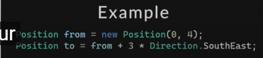
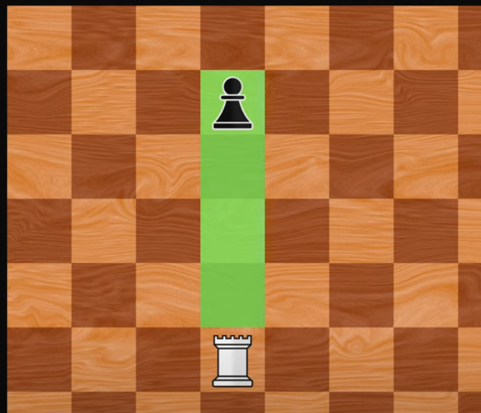
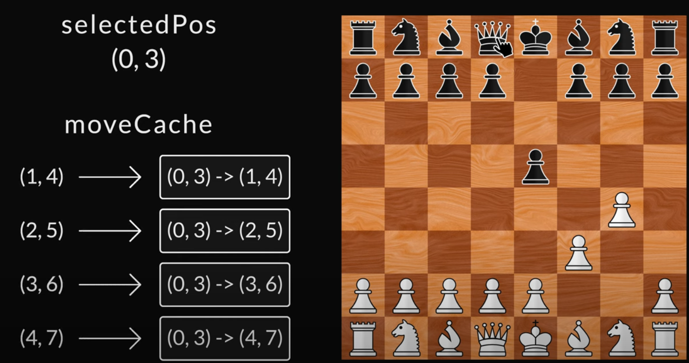
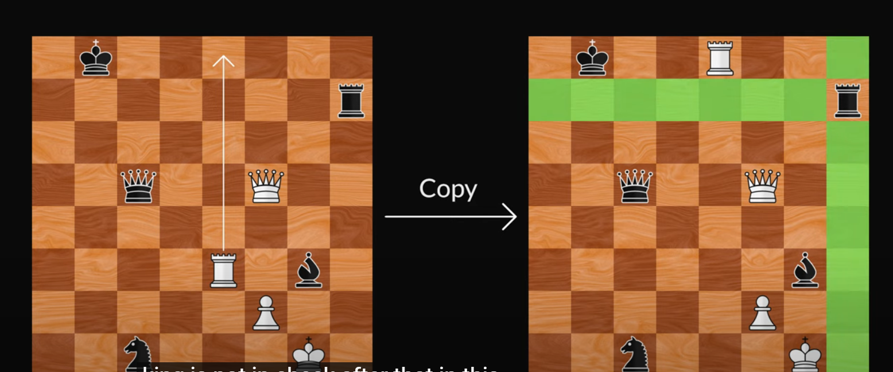
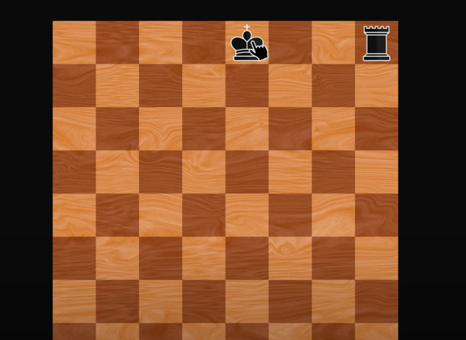
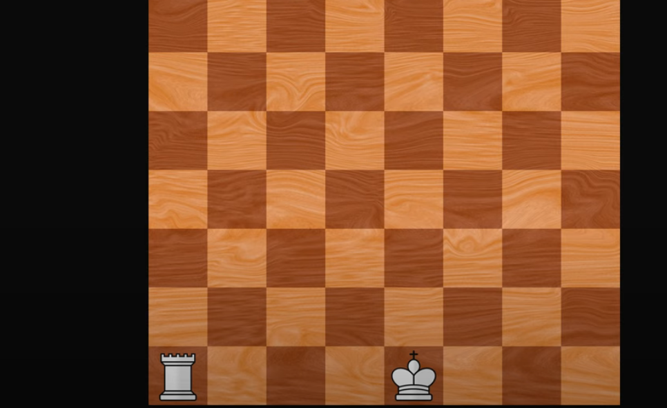
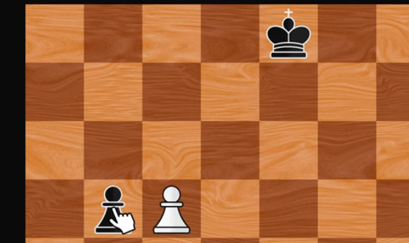

# Table of Contents
- [Introduction](#introduction)
- [Position and Direction](#position-and-direction)
- [Pieces](#image-example)
- [Position and possible moves](#position-and-moves)
- [Select and move cache](#select-and-move-cache)
- [Check Illegal Move](#check-illegal-move))
- [Check Mate & Stale Mate](#checkmate-stalemate))
- [Game over menu and pause menu](#gameover-pause-menu)
- [Pawn promotion logic and menu](#promotion-logic-menu)
- [Castling logic](#castling-logic)
- [En passant logic](#en-passant-logic)
## Introduction
this project follow tutorial from https://www.youtube.com/@OttoBotCode

Logic: 
&nbsp;&nbsp;GameState  
&nbsp;&nbsp;&nbsp;&nbsp;&nbsp;Player (who, who go first) 
&nbsp;&nbsp;&nbsp;&nbsp;&nbsp;Player[] 
&nbsp;&nbsp;&nbsp;&nbsp;&nbsp;Board  
&nbsp;&nbsp;&nbsp;&nbsp;&nbsp;CurrentPiece  
&nbsp;&nbsp;&nbsp;&nbsp;&nbsp;&nbsp;&nbsp;&nbsp;Pieces 

## Position and Direction
record changes to the code
the table start from the top left to the bottom right 0 -> 7
and the position, direction, after overwrite operator, we can enable 
things like this in image:
* from : current position
* to : from + 3 square to the Direction.SouthEast
* this will simplified everything 

## Pieces
all pieces derived from the base class Piece
in /Chest.Logic/Pieces/abstract

## position-and-moves
- this is among the main logic, we first pick a piece  
- then we get its possible moves ( N, S , NE, NW ,...)  
- then in that direction we check how far it can go till it reach the board 
or it meet another pieces ( if of opponent piece, then means it can 
be taken) 
ex img:

- when it reach something, stop, and color those possible path

## select-and-move-cache
- video 6 7 8
- this is the main logic of the game, when we select a piece, we need to
1. select a piece  
2. get position and the move at that position  
3. get all the moves of that piece at the position  
4. set the cache ( with key being the possible ToPosition in move, value being the move itself ), 
get the move from the cache
then display on the grid 

## check-illegal-move
- video 8 - 9
* to check illegal move, these are the step
1. Copy the board ( check the board method) 
2. Move the piece to the new position IN THE COPIED BOARD
3. After move check if the position of the player's king, King.IsCheck(),
4. And if they are checked, then the move user just made is illegal
5. if it does, then the move is illegal

## checkmate-stalemate
- video 9
- it is checked after every MakeMove() in  class : GameState
- CheckGameOver()
1. Get all moves from all piece of the current player
2. select only the moves that are LEGAL  
   ( whose move is not InCheck() )
3. If ( no move is possible for current player)  
   check if IsCheckMate(currentPlayer) to opponent  
   if current player is check mate ==> opponent win
   Else Result.Draw(stalemate...)

## gameover-pause-menu
- video 10, 11
- video 11: add to the main window, display when game finish

## promotion-logic-menu
- video 12
- Add PawnPromotionMove.cs 
- Modify Pawn diagonal and forward move ( extra condtion check)
- modfiy the Click() of the main window, when pawn reach the end 
- and promote

## castling-logic

  
  

 - video 13
- the castling will work like this:
- king move 2 position from current pos, to the direction of the rook
- the rook move behind the king after the king move
- same on both side, W & B, West or East, still 2 move
- use is moved to check if they can be castle ? 
- check if between the king and rook is empty
- check if the king is not in check after castle, if so the
move is not valid also
- new file added: CastleMove.cs , 
- modify: King.cs

## en-passant-logic
- video 14

- this is a special move for pawn, when the pawn move diagonal
- capture the oppoentn pawn a square below the new move, 
- or can be said, capture the pawn next to it on left or right
- look at the logic to see which direction we goin
- only when the opponent move 2 square forward !!
- and the pawn is on the same row as the opponent pawn
- ==> so after some pawn move 2 square, it need to store that for the next 
move , so that opponent pawn can check if possible to capture
- we store this in board
- EnpassentMove.cs , we move to the skipped position of the opponent pawn
- then we capture that pawn
- Add: DoublePawnMove.cs, EnPassantMove.cs, 
- Modify: GameState.cs, Board.cs, Pawn.cs